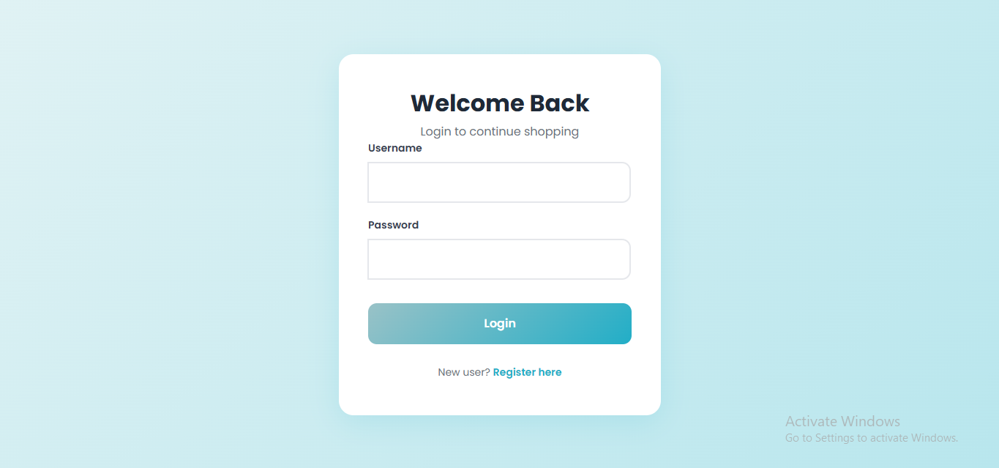

# Shopping Portal Web Application

This is a **full-stack e-commerce web application** built using **React** for the frontend and **Node.js + Express + MongoDB** for the backend. The app allows users to register, login, browse items, add items to a cart, and place orders. Single-device login is enforced for each user.

---
## Live Demo

[Live demo](https://vercel.com/your-project-url)


---

## 📂 Project Structure

```
project/
│
├── backend/
│   ├── models/          # Mongoose models: User, Item, Cart, Order
│   ├── routes/          # API routes for users, items, and orders
│   ├── middleware/      # Authentication middleware
│   ├── server.js        # Express server entry point
│   ├── .env             # Environment variables for backend
│   └── package.json
│
├── frontend/
│   ├── src/
│   │   ├── components/  # React components: Navbar, ItemList, Modal
│   │   ├── services/    # API helper (Axios instance)
│   │   ├── App.jsx      # Main app component
│   │   └── main.jsx     # React entry point
│   ├── .env             # Environment variables for frontend
│   └── package.json
│
└── README.md
```

---

## ⚙️ Features

1. **User Management**



   * User registration and login with JWT authentication.
   * Logout with token cleanup.
   * Single-device login enforcement.

2. **Item Browser**

frontend/public/screenshots/Itemlist.png

   * Fetch and display items from MongoDB.
   * Loading spinner while fetching items.
   * Add items to cart with a button click.

3. **Cart Modal**

frontend/public/screenshots/cartModal.png
   * Displays all items added to the cart.
   * Shows **item name, item ID, and quantity** for each item.
   * User can view cart anytime without page reload.
   * Enhances user experience compared to traditional alert boxes.

4. **Orders Modal**
frontend/public/screenshots/ordersModal.png
   * Displays all previously placed orders.
   * Each order shows its **Order ID** and the list of items in that order.
   * Each item in the order shows **name, ID, and quantity**.
   * Orders are shown separately; items are not grouped across different orders.

5. **Checkout**

   * Converts current cart into an order.
   * Clears the cart after successful checkout.

---

## 🛠️ Technology Stack

**Frontend:**

* React 18
* React Router
* Axios
* Bootstrap 5 for styling

**Backend:**

* Node.js + Express
* MongoDB + Mongoose
* bcryptjs for password hashing
* jsonwebtoken for JWT authentication
* CORS middleware


## 🎥 Video Demonstration

* A full walkthrough video of the application demonstrating login, browsing items, cart functionality, checkout, and viewing orders.
* Place your video link here: **[Insert Google Drive Link]**

---

## 🔒 Git Ignore

### Backend `.gitignore`

```
node_modules/
.env
```

### Frontend `.gitignore`

```
node_modules/
.env
dist/
```


